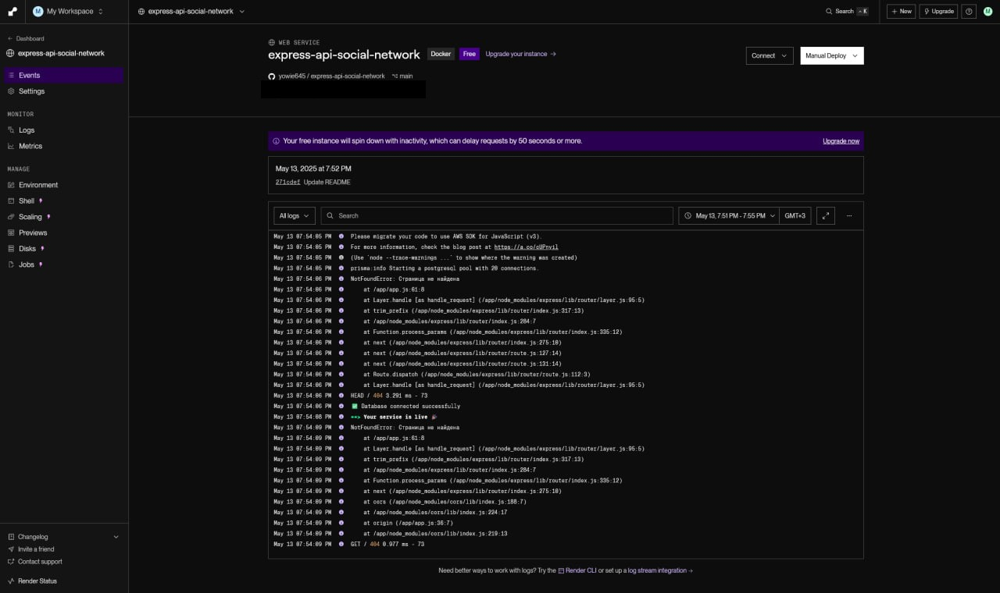
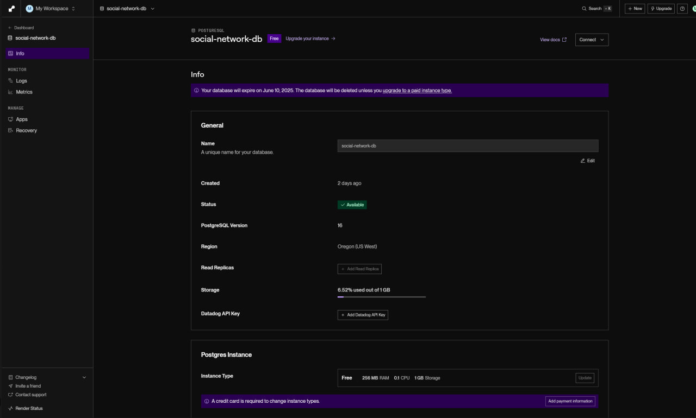
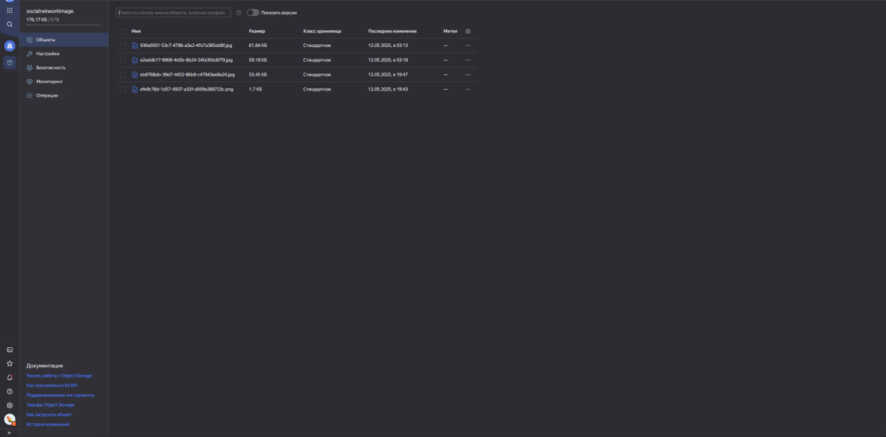

<h1 align="center">💫 About Project:</h1>

## 🧸 ExpressClientSocialNetwork — Backend API

This is the server part of a social network written in Node.js using Express. The API provides functionality for registration, authentication, user profile management, publications, and subscriptions.

## Base URL

- http://localhost:3000/api

## 💻 Tech Stack:

   

- **This is the backend repository the frontend for this repository is located here - https://github.com/yowie645/client-social-network**

### ✨ Key Features

- **User Profiles:** View and edit your profile with ease.
- **News Feed:** Stay updated with the latest posts from your network.
- **Reactions & Comments:** Like posts and join discussions.
- **Avatar & Cover Updates:** Easily change your profile and cover images.
- **Followers & Subscriptions:** Track who follows you and manage your subscriptions.

### 📄 API Documentation

# API Documentation

| Method | Endpoint(Auth) | Request Body (JSON)                                      | Description         |
| ------ | -------------- | -------------------------------------------------------- | ------------------- |
| `POST` | `/register` ❌ | `{"email":"string","name":"string","password":"string"}` | User registration   |
| `POST` | `/login`       | `{"email":"string","password":"string"}`                 | User authentication |

## 📸 Screenshots

### 🖼️ Interface

---

## 🛠️ Installation

### Prerequisites

- Uses [Vite](https://vitejs.dev/), [Vitest](https://vitest.dev/), and [React Testing Library](https://github.com/testing-library/react-testing-library) to create a modern [React](https://react.dev/) app compatible with [Create React App](https://create-react-app.dev/)
- Node.js

## 🪭 Quick Setup

### Clone repository

- git clone https://github.com/yowie645/client-social-network.git
- cd client-social-network

## Scripts

- `dev`/`start` - start dev server and open browser
- `build` - build for production
- `preview` - locally preview production build
- `test` - launch test runner

### Run

- npm run dev

